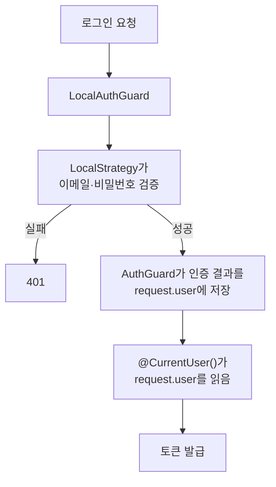
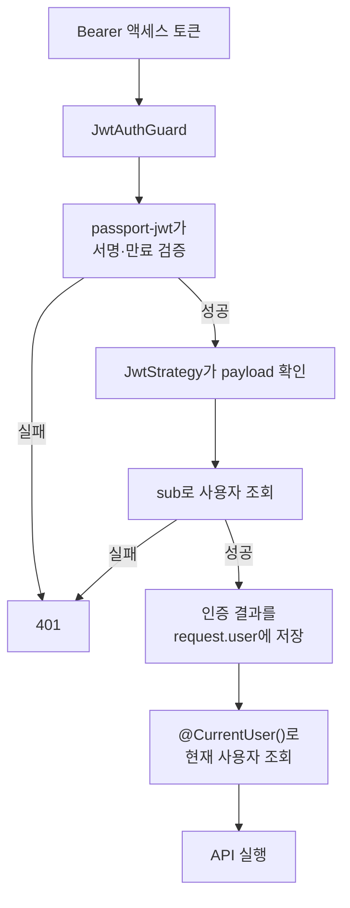

# Passport 로그인과 API 인증

## 작업 개요

이메일과 비밀번호로 회원가입·로그인하고, 발급된 액세스 토큰으로 사용자를 인증합니다.

## API

- `POST /auth/register`: 이메일 중복 확인 후 비밀번호를 해시해 사용자를 저장합니다.
- `POST /auth/login`: 이메일과 비밀번호가 일치하면 액세스 토큰과 리프레시 토큰을 발급합니다.
- `GET /auth/me`: 액세스 토큰으로 사용자를 인증하고 현재 사용자 정보를 반환합니다.

## 핵심 흐름

### 로그인

인증은 `LocalStrategy`와 `AuthGuard`에서 처리됩니다. 프로젝트에서 만든 `@CurrentUser()`는 `request.user`만 읽습니다.

### 인증이 필요한 API

서명과 만료는 `passport-jwt`가 검증합니다. `JwtStrategy`는 payload와 사용자를 확인합니다.

## 새로 학습한 내용

### 프레임워크가 처리하는 부분

- NestJS Guard는 컨트롤러보다 먼저 실행됩니다.
- Passport `AuthGuard`는 지정된 Strategy를 실행하고 인증 실패를 401로 처리합니다.
- 인증에 성공하면 Strategy의 반환값을 `request.user`에 저장합니다.

### 직접 설정한 부분

- Local Strategy는 로그인 식별자로 `email`을 사용하고 요청 IP를 전달합니다.
- JWT Strategy는 Bearer 토큰을 추출하고 환경변수의 비밀키를 사용합니다.

## 관련 코드

- [컨트롤러](../../src/auth/auth.controller.ts)
- [Strategy](../../src/auth/strategies)
- [E2E 테스트](../../test/auth.e2e-spec.ts)
