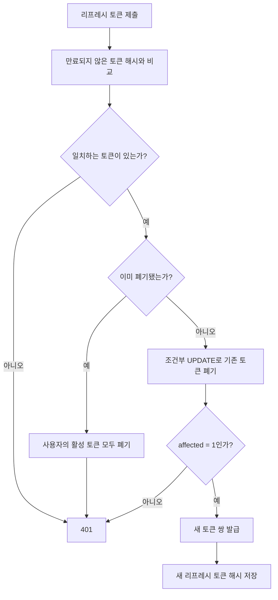
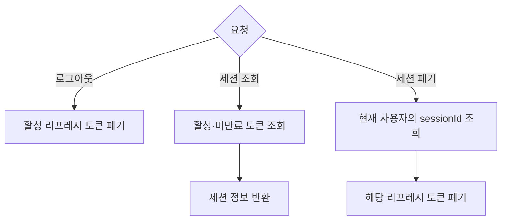

# 리프레시 토큰과 세션 폐기

## 작업 개요

리프레시 토큰을 한 번만 사용하도록 교체하고, 재사용된 토큰이 발견되면 사용자의 활성 세션을 모두 폐기합니다.

## API

- `POST /auth/refresh`: 제출한 리프레시 토큰을 폐기하고 새로운 액세스 토큰과 리프레시 토큰을 발급합니다.
- `POST /auth/logout`: 제출한 리프레시 토큰에 해당하는 세션을 폐기합니다.
- `GET /auth/sessions`: 현재 사용자의 활성 세션을 조회합니다.
- `DELETE /auth/sessions/:sessionId`: 선택한 활성 세션을 폐기합니다.

## 핵심 흐름

### 토큰 재발급

기존 토큰 폐기에 성공한 요청만 새 토큰을 발급합니다. 같은 토큰으로 동시에 들어온 나머지 요청은 401을 반환합니다.

### 로그아웃과 세션 관리

## 새로 학습한 내용

- 리프레시 토큰은 원문 대신 `bcrypt` 해시로 저장하고, 검증할 때 제출된 원문과 비교합니다.
- 현재 구현은 미만료 토큰을 모두 조회한 뒤 해시를 하나씩 비교합니다.
- 재발급에 사용한 토큰은 폐기하고 새 토큰으로 교체합니다.
- 폐기된 토큰이 다시 제출되면 사용자의 활성 토큰을 모두 폐기합니다.
- 활성 리프레시 토큰을 로그인 세션으로 조회하고 폐기합니다.
- 조건부 `UPDATE`의 `affected` 값으로 한 요청만 성공시킵니다.

## 변경 전후

- 처음에는 리프레시 토큰을 검증한 뒤 액세스 토큰만 새로 발급했습니다.
- 이후 사용한 리프레시 토큰을 폐기하고 새 토큰으로 교체하도록 변경했습니다.
- 이후 재사용 탐지, 세션 관리, 동시 재발급 방지를 추가했습니다.

## 관련 코드

- [인증 컨트롤러](../../src/auth/auth.controller.ts)
- [인증 서비스](../../src/auth/auth.service.ts)
- [E2E 테스트](../../test/auth.e2e-spec.ts)
