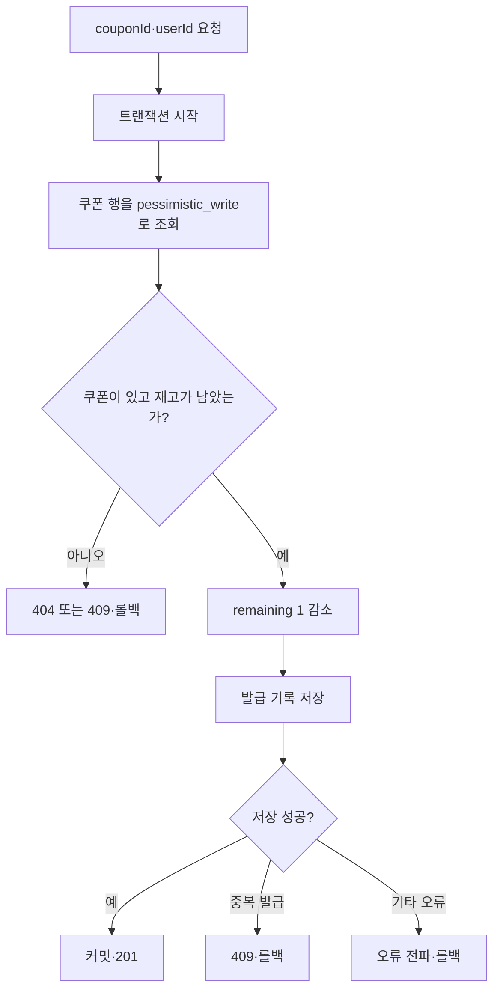

# 쿠폰 동시성

## 작업 개요

쿠폰 발급 API에 동시 요청이 들어와도 재고를 초과하거나 같은 사용자에게 중복 발급되지 않습니다.

## API

- `POST /coupons/:couponId/claims`: 쿠폰 재고를 1 차감하고 요청한 사용자의 발급 기록을 저장합니다.

## 핵심 흐름

쿠폰 행의 잠금은 트랜잭션이 끝날 때까지 유지됩니다. 다음 요청은 앞선 요청이 반영한 재고를 읽습니다.

## 새로 학습한 내용

- 여러 요청이 같은 재고를 읽으면 초과 발급될 수 있습니다.
- 중간 단계에서는 조건부 `UPDATE`의 `affected` 값으로 재고 감소 성공 여부를 판단했습니다.
- 수량 감소와 발급 기록 저장은 함께 커밋하거나 롤백해야 합니다.
- `(userId, couponId)` 고유 제약 조건으로 중복 발급을 막습니다.
- `pessimistic_write`는 `SELECT ... FOR UPDATE`로 쿠폰 행을 잠급니다.

## 변경 전후

- 기존에는 조회 후 저장하는 동안 여러 요청이 같은 재고를 읽었습니다.
- 조건부 `UPDATE`를 적용해 초과 발급을 막았습니다.
- 이후 트랜잭션과 고유 제약 조건으로 불일치와 중복도 막았습니다.
- 현재는 비관적 잠금으로 같은 쿠폰의 발급 요청을 순서대로 처리합니다.

## 관련 코드

- [쿠폰 컨트롤러](../../src/coupons/coupons.controller.ts)
- [쿠폰 서비스](../../src/coupons/coupons.service.ts)
- [E2E 테스트](../../test/coupons.e2e-spec.ts)
