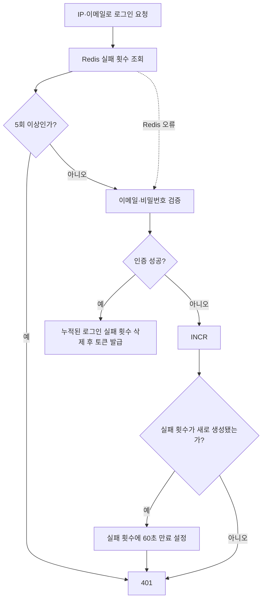
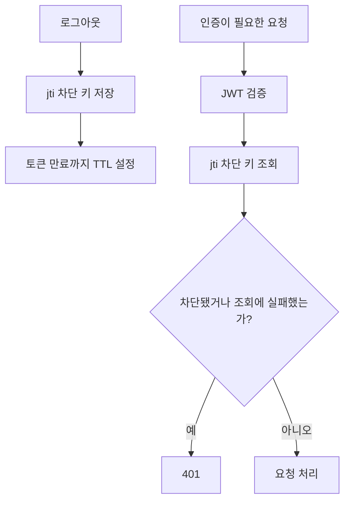

# Redis를 이용한 인증 상태 관리

## 작업 개요

로그인 실패 횟수가 제한에 도달하면 로그인을 차단하고, 로그아웃한 액세스 토큰은 만료 시각까지 다시 사용할 수 없습니다.

## API

- `POST /auth/login`: 로그인 실패 횟수를 기록해 제한에 도달한 요청을 차단하고, 성공하면 기록을 삭제합니다.
- `POST /auth/logout`: 리프레시 토큰을 폐기하고 액세스 토큰을 만료 시각까지 차단합니다.
- 인증이 필요한 API: 액세스 토큰이 차단된 경우 요청을 거부합니다.

## 핵심 흐름

### 로그인 실패 제한

같은 IP와 이메일의 로그인 실패 횟수를 첫 실패부터 60초 동안 누적합니다. 이 기간에 5회 실패하면 해당 60초가 끝날 때까지 다음 로그인 요청을 차단합니다. 60초가 지나거나 로그인에 성공하면 실패 횟수를 초기화합니다.

Redis 조회가 실패해도 이메일과 비밀번호는 계속 검증합니다. 건너뛰는 것은 로그인 실패 제한뿐입니다.

### 액세스 토큰 차단

차단 여부를 확인할 수 없으면 인증 요청을 거부합니다. 로그아웃한 토큰이 통과할 가능성을 막기 위해서입니다.

## 새로 학습한 내용

- TTL을 사용해 인증 상태를 필요한 기간만 유지합니다.
- `INCR`는 로그인 실패 횟수를 원자적으로 증가시킵니다.
- 현재 구현의 `INCR`와 첫 `EXPIRE`는 별도 명령이므로 둘을 하나의 원자적 작업으로 보장하지는 않습니다.
- JWT의 `jti`를 액세스 토큰 차단 키로 사용합니다.
- 로그인 제한은 Redis 장애 시에도 비밀번호 검증을 계속하는 fail-open 방식입니다.
- 액세스 토큰 차단은 Redis 장애 시 인증을 거부하는 fail-closed 방식입니다.

## 변경 전후

- 기존에는 Redis 장애가 발생하면 정상 로그인도 실패했습니다.
- 로그인 제한에는 fail-open을 적용해 비밀번호 검증을 계속하도록 변경했습니다.
- 액세스 토큰 차단에는 보안을 우선해 fail-closed를 적용했습니다.

## 관련 코드

- [인증 서비스](../../src/auth/auth.service.ts)
- [JWT Strategy](../../src/auth/strategies/jwt.strategy.ts)
- [E2E 테스트](../../test/auth.e2e-spec.ts)
