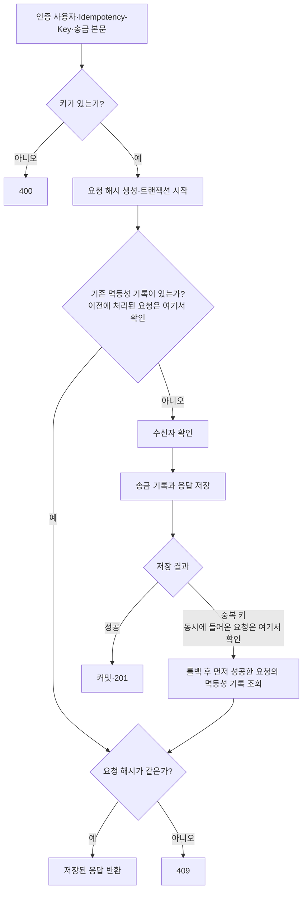

# 같은 송금 요청을 한 번만 처리하기

## 작업 개요

같은 멱등키와 내용으로 송금 요청을 반복해도 요청은 한 번만 생성되고 최초 응답을 반환합니다.

## API

- `POST /transfers`: 실제 자금 이동 없이 발신자, 수신자, 금액을 담은 송금 요청을 생성합니다.

## 핵심 흐름

## 새로 학습한 내용

- `Idempotency-Key`로 같은 요청을 찾습니다.
- `(userId, key)`로 구분해 사용자별로 같은 키를 허용합니다.
- 본문 해시가 다르면 같은 키의 재사용을 거부합니다.
- 송금 기록과 재사용할 응답을 한 트랜잭션에 저장합니다.
- 동시 요청은 고유 제약 조건으로 하나만 저장하고 나머지는 기존 응답을 조회합니다.

## 관련 코드

- [송금 컨트롤러](../../src/transfers/transfers.controller.ts)
- [송금 서비스](../../src/transfers/transfers.service.ts)
- [E2E 테스트](../../test/transfers.e2e-spec.ts)
