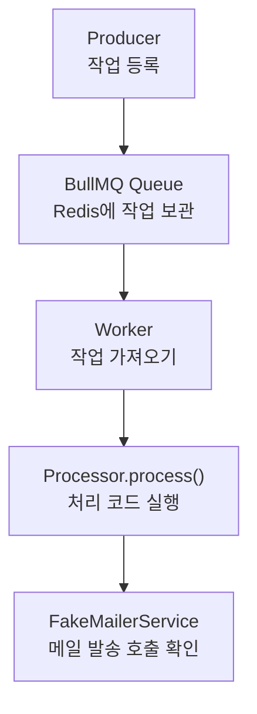

# 이메일 인증 작업 큐

## 작업 개요

BullMQ로 이메일 인증 작업의 등록과 처리를 분리했습니다. 메시지 큐 개념을 학습한 단계이며 회원가입 API와 실제 메일 발송에는 연결하지 않았습니다.

## 메모

- Producer는 `Queue.add()`로 작업을 등록하고, BullMQ는 작업과 상태를 Redis에 저장합니다.
- 앱이 시작되면 Nest가 `@Processor(EMAIL_QUEUE)`를 발견하고 BullMQ Worker를 만듭니다.
- Worker가 Queue에서 작업을 가져오면 BullMQ가 `Processor.process()`를 호출합니다.
- Producer는 Processor를 직접 호출하지 않습니다.
- 작업 실패 시 최대 3회까지 지수 백오프로 재시도합니다. 성공 작업은 제거하고 최종 실패 작업은 남깁니다.
- 같은 `jobId`가 Queue에 남아 있을 때만 중복 등록을 막습니다. 현재 `jobId`는 BullMQ 공식 문서가 금지하는 `:`를 구분자로 사용합니다.
- Producer와 Processor만 단위 테스트했습니다. Redis를 통한 전체 작업 전달은 검증하지 않았습니다.

## 관련 코드

- [Producer](../../src/email-verification/email-verification.producer.ts)
- [Processor](../../src/email-verification/email-verification.processor.ts)
- [Producer 테스트](../../src/email-verification/email-verification.producer.spec.ts)
- [Processor 테스트](../../src/email-verification/email-verification.processor.spec.ts)
